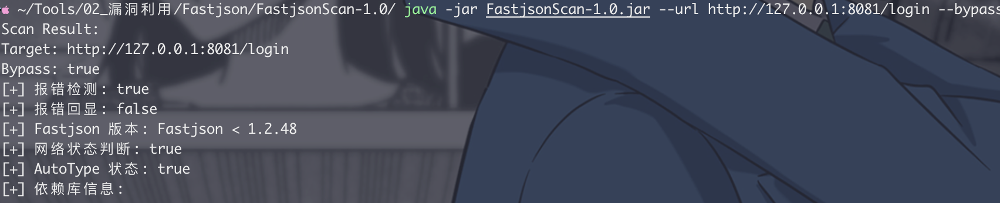
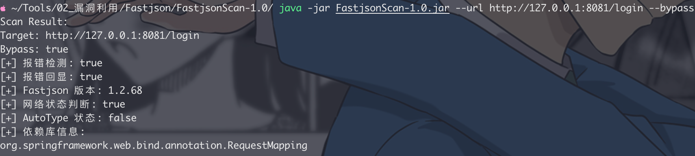

# FastjsonScan


## 功能：

- [x] 1.2.83及以下的区间探测
- [x] 支持报错回显探测
- [x] DNS出网检测
- [x] 支持AutoType状态检测
- [x] 依赖库检测
- [x] Unicode编码绕过waf
- [x] 可扩展payload
- [x] exp命中探测
- [ ] 延迟检测
- [ ] 批量检测

## Usage

```markdown 
usage: FastjsonScan
--bypass         Enable bypass mode
-h,--header <arg>   Custom request header
-u,--url <arg>      Specify the URL (required)
```


## Demo





## 参考

[https://github.com/pmiaowu/BurpFastJsonScan](https://github.com/pmiaowu/BurpFastJsonScan "https://github.com/pmiaowu/BurpFastJsonScan")

[https://github.com/a1phaboy/FastjsonScan](https://github.com/a1phaboy/FastjsonScan "https://github.com/a1phaboy/FastjsonScan")

[https://github.com/safe6Sec/Fastjson](https://github.com/safe6Sec/Fastjson "https://github.com/safe6Sec/Fastjson")

## 许可证

版权所有 © 2025 [GG Bond](https://github.com/seizer-zyx/FastjsonScan "GG Bond")。

该项目已获得[MIT](https://github.com/seizer-zyx/FastjsonScan/blob/main/LICENSE "MIT")许可。
